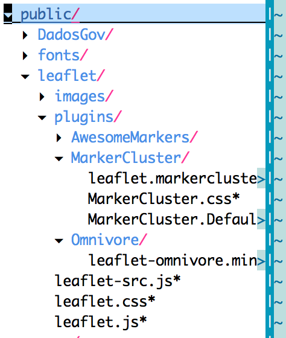

NO LONGER MAINTAINED.

# meteor-leaflet-maps
Leaflet, now with lazy loading &amp; namespacing!

### Reasons to use:
 - Pulls files from the leaflet CDN, or your local copy (faster for dev on local box)
 - Can choose different versions manually (great in case I'm slow to update or if there's a regression)
 - Only loads when you need it
 - Supports multiple maps
 - Let you load any leaflet plugin
 - Gives you a namespace to store markers change the map from a different file, etc.
 - Obviates the need for a `window.onload`

### Credits
 - This is basically a rip-off of DBurles' GoogleMaps, but with a couple perks. That, and it's for leaflet.

### Installation
    $ meteor add mattkrick:leaflet-maps

### Loading Scripts
Loading js & css when you don't need it isn't cool. Now, you can load it the first time it's called.

```javascript      
    Router.onBeforeAction(function() {
      leafletMaps.load({options});
      this.next();
    }, { only: ['routeOne', 'routeTwo'] });
```

You can check if leaflet and it's plugins are ready to be used by typing this in the console:

```javascript
leafletMaps.arePluginsLoaded.get();
```

### Options

Options are passed in via an object:

```javascript
  var options = {version: '0.7.3', local: true, plugins: ['markerCluster']};
```
    
`version`: optional, defaults to current version of 0.7.3 (for CDN loads only)

`local`: optional, defaults to false. If true, will load your core js & css from "/public/leaflet/"

`pluginRoot` optional, defaults to "/public/leaflet/plugins". This is where you put all your plugins js & css files.

`plugins` optional, Array. Feel free to add any plugin by using one of the 
available options(always before calling ```leafletMaps.load()```):

#### 1) Extend Meteor.settings.leafletMaps.plugins.pluginName, for example:

```
On a settings.json file, start your app with meteor --settings
settings.json
```

```json
  "leafletMaps": { 
    "plugins": {
      "omnivore": {
        "cssFiles": [],
        "jsFiles": ["Omnivore/leaflet-omnivore.min.js"]
      },
    }
  }
```

Or, by writing to ```Meteor.settings``` before calling ```leafletMaps.load()```
method:

```javascript
  Meteor.settings.plugins.omnivore = {
      cssFiles: [],
      jsFiles: ['Omnivore/leaflet-omnivore.min.js']
  }
```

#### 2) Use leafletMaps.addPlugins()

```javascript
 leafletMaps.addPlugins({
    omnivore: {
      cssFiles: [],
      jsFiles: ['Omnivore/leaflet-omnivore.min.js']
    }
  });
  var options = {version: '0.7.3', local: true, plugins: ['omnivore']};
  leafletMaps.load({options});
```

After adding a plugin with one of the methods above, just drop the required
files into the `pluginRoot` & it'll find them & install them after the core
loads, as follows:


     
### Putting it in a template

```{{>leafletMap name="exampleMap" options=leafletOptions}}```

`name` is the namespace.

`options` includes, things like your tileLayer, latLng (optional), and zoom (optional)

You can always find your map globally at `leafletMaps.maps.name`.

Your map object has 2 properties. `instance` and `options`.

Make sure the parent Div has a height & width!

#### Creating a helper
Personally, I like to create a global helper so I can use the same basic options for all my maps. It looks like this:

```javascript
    Template.registerHelper('leafletOptions', function() {
      if (leafletMaps.canSetOptions()) { //only necessary if you use an `L` method
        return {
          tileLayer: L.tileLayer('https://{s}.tiles.mapbox.com/v4/{mapId}/{z}/{x}/{y}.png?access_token={token}', {
            attribution: 'Map data &copy; <a href="http://openstreetmap.org">OpenStreetMap</a> contributors, <a href="http://creativecommons.org/licenses/by-sa/2.0/">CC-BY-SA</a>, Imagery © <a href="http://mapbox.com">Mapbox</a>',
            subdomains: ['a','b','c','d'],
            mapId: 'Username.MapID',
            token: 'IAlwaysThoughtItWasOddToCallAuthorizationKeysTokens'
          }),
          center: [40,-122], //Remember, it's lat, then lng. Doesn't conform to geoJSON standards!
          zoom: 13
        };
      }
    });
```
### Workin' it
The magic happens inside a `ready` callback. `ready` means the scripts have been downloaded, loaded, and the map template has been rendered.
That means the map fully loads all its tiles, all the time. No race conditions, no ugly `window.onload`, and you can load as many maps as you want.

```javascript
    Template.spots.onRendered(function() {
      leafletMaps.ready('exampleMap', function (map) {
        Spots.find().observeChanges({
          added: function (id, fields) {
            console.log(fields);
            L.marker(flipCoords(fields.loc.coordinates)).addTo(map.instance);
          }
        });
      });
    });
```

### Changelog

#### 0.3.0 – 2015-07-18
* Fixed multiple plugins loading, will set leaflet available only after ALL plugins are ready
* Added API to load custom plugins
* Fixed README markdown notations and elaborated more on plugins section

#### 0.2.0 – 2015-07-01
* Added plugins, local file loading 
* Fixed bug by stopping a computation in an autorun which could recreate a map

#### 0.1.0 – 2015-04-04
* Initial

### License
MIT
